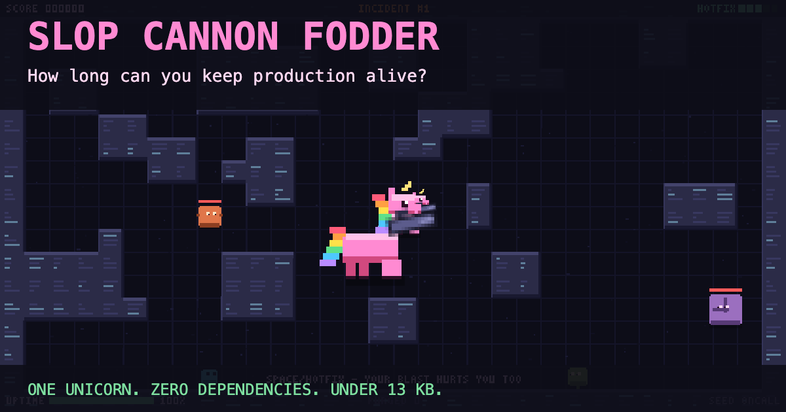

[](https://js13kgames.com/)
[](https://github.com/features/copilot)


Created for [js13kGames](https://js13kgames.com/) competition.
**Theme:** Rainbows and Unicorns. **Constraint:** web only, <= 13KB.

# Slop Cannon Fodder

<p align="center">
  <a href="dist/slop-cannon-fodder.min.html">
    
  </a>
</p>

Survive production slop as an on-call unicorn, blasting through waves of bugs with upgrades and hotfix grenades.

### [🌈 Play now →](dist/slop-cannon-fodder.min.html)

Download the linked HTML file and open it in a browser, or run `npm run play` from a local checkout.


**Controls:** <kbd>WASD</kbd> / <kbd>arrow keys</kbd> move · mouse aims / hold left click fires · <kbd>Space</kbd> / right click throws a hotfix grenade · <kbd>M</kbd> mutes

| Input | Action |
| --- | --- |
| <kbd>P</kbd> / <kbd>Esc</kbd> | Pause |
| <kbd>Enter</kbd> after defeat | Retry the same seed |
| <kbd>N</kbd> | Skip between waves |
| <kbd>1</kbd> / <kbd>2</kbd> / <kbd>3</kbd> | Choose an upgrade |

On touchscreens, drag on the left to move and hold on the right to aim and fire.
Use the Hotfix and Pause buttons.

## Features

- Wave-based arena combat with upgrade drafts and hotfix grenades.
- Procedural pixel art, rainbow trails, and audio in one self-contained HTML file.
- Daily UTC seeds, same-seed retries, personal bests, and shareable score challenges.

## Development

Requires [Node.js](https://nodejs.org/) 18 or later and npm. No dependencies to install.
Edit `src/index.html`.

```sh
# Run locally (opens src/index.html in your browser)
npm run dev

# Build the standalone game and size report
npm run build

# Run tests
npm test
```

Build output: `dist/slop-cannon-fodder.min.html`.
The build checks a 13KB **gzipped** budget and writes `dist/size-report.txt`;
it does not create a submission ZIP.

Generate a landing page with social previews:

```sh
npm run build:hosted -- "https://example.com/game/"
```

Use your public hosting URL, then upload `dist/hosted/` there.

## Contributing

Contributions welcome! This was a short-lived competition project, so ongoing
maintenance isn't guaranteed. Feel free to fork it and make it your own.

## License

MIT.
