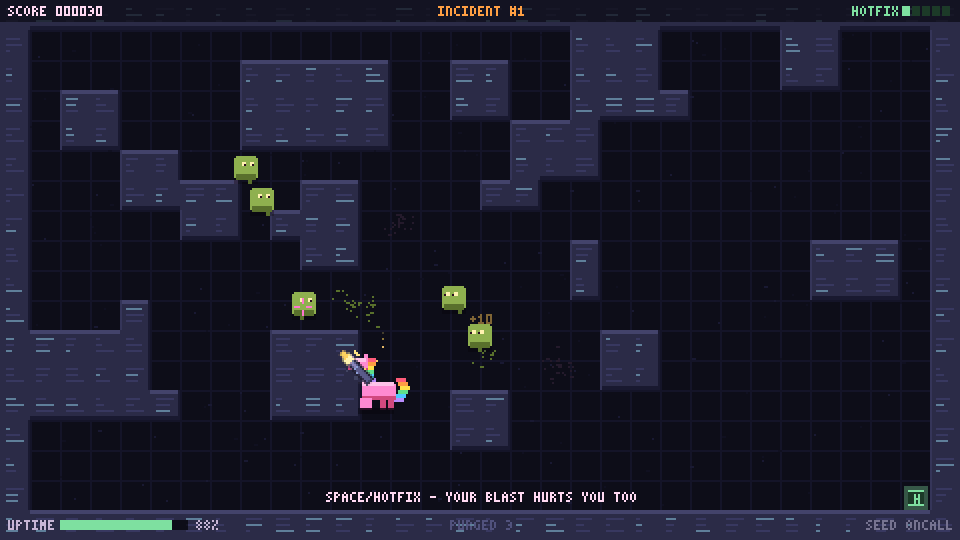

# Slop Cannon Fodder

A pixel arena shooter about an on-call unicorn fighting production slop.
Survive waves, choose upgrades, and throw hotfix grenades.



One HTML file, under 13 KB gzipped, with procedural art and audio.

## Play

Open [`dist/slop-cannon-fodder.min.html`](dist/slop-cannon-fodder.min.html) in a browser, or run:

```sh
npm run play
```

| Input | Action |
| --- | --- |
| WASD / arrow keys | Move |
| Mouse / hold left click | Aim / fire |
| Right click / Space | Throw a hotfix grenade |
| P / Esc | Pause |
| M | Mute |
| Enter after defeat | Retry the same seed |
| N | Skip between waves |
| 1 / 2 / 3 | Choose an upgrade |

On touchscreens, drag on the left to move and hold on the right to aim and fire.
Use the Hotfix and Pause buttons.

## Development

Requires Node.js. Edit `src/index.html`.

```sh
npm run dev     # Open src/index.html
npm run build   # Build the standalone game and size report
npm test
```

Generate a landing page with social previews:

```sh
npm run build:hosted -- "https://example.com/game/"
```

Use your public hosting URL, then upload `dist/hosted/` there.

## License

MIT.
